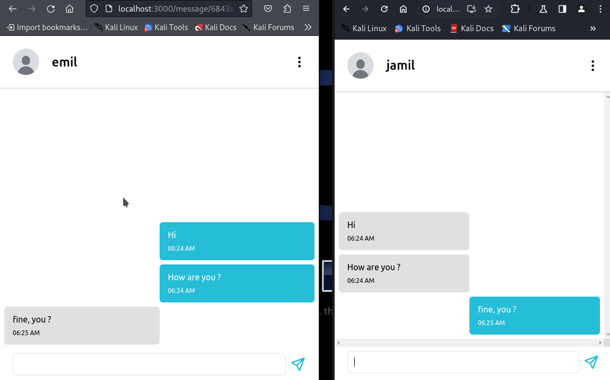
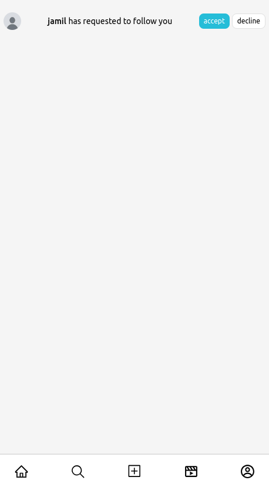
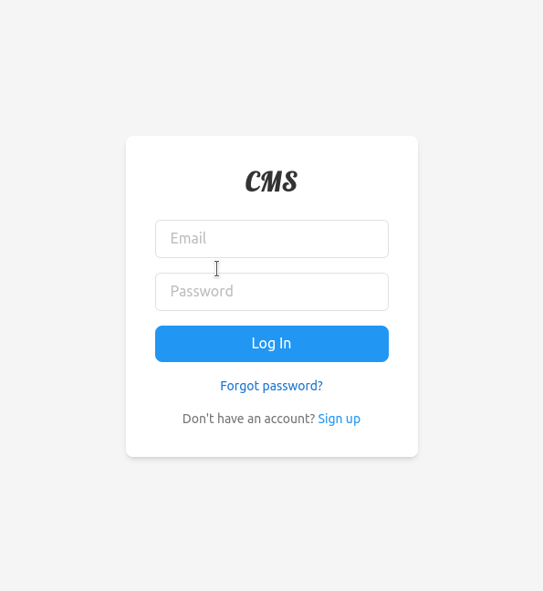

# Real-Time Messenger Application

A full-stack messaging application. Users can send friend requests, chat instantly, and manage conversations in real time.

## Features
- 🔐 **JWT Authentication** - Secure login/registration
- 👥 **Friend Management** - Send/accept friend requests
- 💬 **Real-Time Messaging** - Instant message delivery

## Tech Stack
### Frontend
- **React 18**
- **Redux**
- **Redux Toolkit**
- **Socket.IO Client**
- **Tailwind CSS**
- **React Router 6**
- **Axios**

### Backend
- **Node.js 18+**
- **Express.js**
- **MongoDB** (Mongoose ODM)
- **Socket.IO**
- **JSON Web Tokens**

## Installation

### Prerequisites
- Node.js v18+


### Setup
1. Clone repository:

```
  git clone git@github.com:jamil-babayev/Messaging-App.git
  cd Messaging-App
```

2. Start node.js process:

```
  cd server
  npm install
  node server.js &
```

3. Start react process

```
  cd client
  npm install
  npm start
```

### Snapshots




